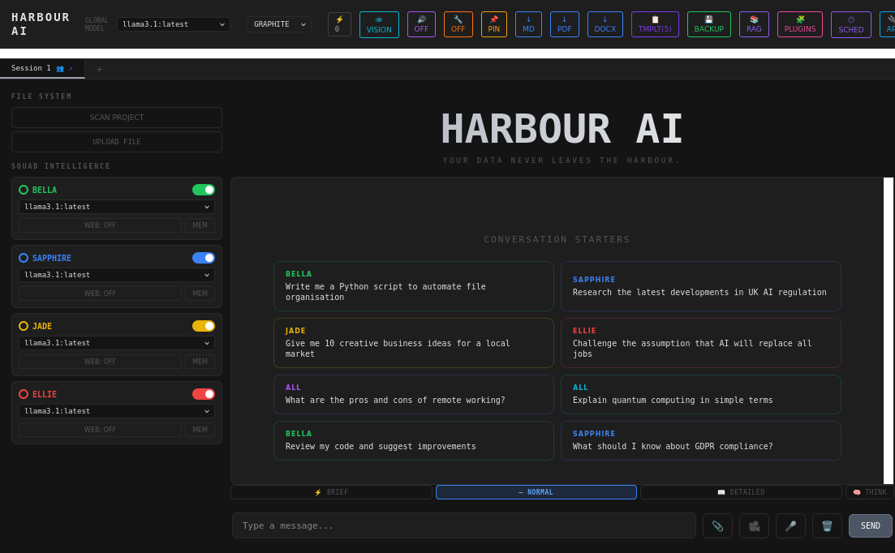

<!-- NOTE: the direct-download links below are version-pinned (HARBOUR-AI-1.0.134.*).
     Bump them on every release, or they 404. -->

# HARBOUR AI

## Private AI for people who can't send their data to the cloud.

A complete AI workforce — five specialist agents and 120+ business tools — that runs **entirely on your own computer**. No cloud. No subscription. No data leaving your machine. And now, provably so: every answer carries a cryptographic receipt you can verify yourself.

---

## ⬇ Download — free 14-day trial, no card

| Windows | Linux | macOS |
|:---:|:---:|:---:|
| [**Download installer (.exe)**](https://github.com/LOOSEKEY/harbour-ai-releases/releases/latest/download/HARBOUR-AI-1.0.134-Setup.exe) | [**Download AppImage**](https://github.com/LOOSEKEY/harbour-ai-releases/releases/latest/download/HARBOUR-AI-1.0.134.AppImage) | *Coming soon* |
| [Portable .exe](https://github.com/LOOSEKEY/harbour-ai-releases/releases/latest/download/HARBOUR-AI-1.0.134-Portable.exe) | [.deb package](https://github.com/LOOSEKEY/harbour-ai-releases/releases/latest/download/HARBOUR-AI-1.0.134.deb) | |

You'll also need [**Ollama**](https://ollama.com) — the free local AI engine. Two minutes, one command ([3-step setup below](#-get-running-in-3-steps)). *[Browse all releases →](https://github.com/LOOSEKEY/harbour-ai-releases/releases/latest)*

---

## Why HARBOUR, not ChatGPT?

🔒 **Your data never leaves.** Everything runs on your machine — chats, documents, everything. Nothing is sent anywhere, ever. For solicitors, accountants, clinicians, and anyone bound by GDPR or client confidentiality, that isn't a feature — it's the whole point.

✅ **And you can prove it.** Every AI answer is cryptographically signed. Verify any output — or your entire audit trail — at [harbour-ai.co.uk/verify](https://harbour-ai.co.uk/verify), with no HARBOUR install needed. No cloud AI can offer this, because their business *is* your data leaving.

👥 **A workforce, not a chatbot.** Five specialists — EMMA, BELLA, SAPPHIRE, JADE, ELLIE — debate and synthesise every answer, across 120+ ready-made tools built for UK business.

💷 **Pay once.** £149, yours forever. No subscription, no usage fees, no phone-home.

---

## What's inside

**Five agents working together on every query:**

| Agent | Role |
|---|---|
| 💖 **EMMA** | Orchestrator — synthesises a final verdict across the squad |
| 💚 **BELLA** | Code & technical |
| 💙 **SAPPHIRE** | Research & analysis |
| 💛 **JADE** | Creative & lateral thinking |
| ❤️ **ELLIE** | Critic & devil's advocate |

**120+ tools**, including:

- 🛡 **Trust Layer** — signed AI receipts, tamper-evident audit ledger, encrypted vault, e-signature, injection firewall
- ⚖️ **Legal** — contract drafting & review, NDA builder, conveyancing, employment law, SRA conflict checks
- 💷 **Finance** — payroll with HMRC RTI, Open Banking (15 UK banks), MTD VAT/ITSA, invoicing, cash-flow forecasting
- 🏥 **Healthcare** — NHS FHIR R4, CQC self-assessment, clinical decision support, GP referrals
- 📋 **Compliance** — full GDPR suite (DPIA, RoPA, DSAR, breach response), ISO 27001, Cyber Essentials evidence
- 👥 **HR & Sales** — HRIS, recruitment & AI video interviews, CRM, proposals, client sentiment monitoring
- 🧭 **Sector packs** — conveyancing, insurance, recruitment, property & lettings, and more
- 🎙 **Productivity** — live meeting transcription, document intelligence, workflow automation, Company Brain knowledge graph

[See everything at harbour-ai.co.uk →](https://harbour-ai.co.uk)

---

## 🚀 Get running in 3 steps

1. **Install [Ollama](https://ollama.com)** — the free local AI engine
2. **Download HARBOUR** for your platform (above) and launch it
3. **It pulls a model on first run** (`llama3.1`) — then you're working, fully offline from there on

> **Requirements:** Windows 10/11 or Linux (Ubuntu 20.04+ / Debian 11+) · 8 GB RAM (16 GB recommended) · ~6 GB disk for the app + model. No internet needed after setup.

---

## Pricing

| Tier | Price | Users |
|---|---|---|
| **Solo** | £149 one-time | 1 |
| **Business** | £999 one-time | 25 — shared Company Brain, SSO, audit trail |
| **Reseller** | £2,499 one-time | 50 white-label seats |
| **Enterprise** | from £9,999 | Unlimited — custom deployment, SLA, onboarding |

One-time purchase, yours forever. Optional **HARBOUR CARE** annual support: Solo £59/yr · Business £199/yr. [Full pricing →](https://harbour-ai.co.uk/#pricing)

---

## Links

[Our story](STORY.md) · [Website](https://harbour-ai.co.uk) · [User Manual](https://harbour-ai.co.uk/manual.html) · [Verify a receipt](https://harbour-ai.co.uk/verify) · [GDPR & governance](https://harbour-ai.co.uk/gdpr.html) · [Enterprise](https://harbour-ai.co.uk/enterprise.html) · Support: loosekeyz84@proton.me

---

*HARBOUR AI — your data never leaves the harbour.*
